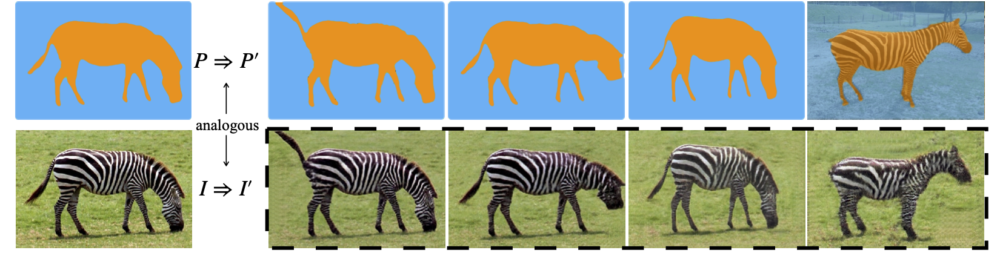
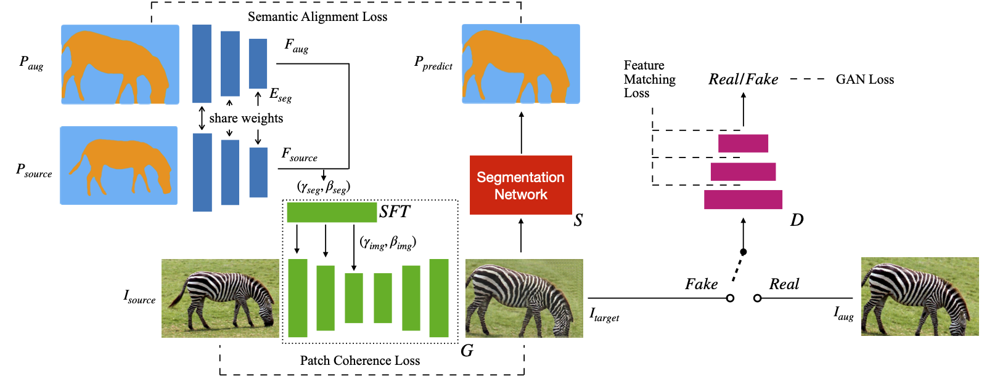
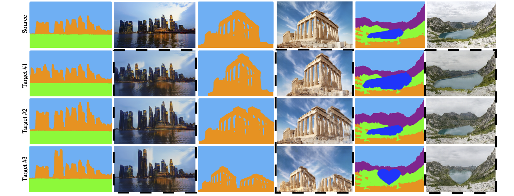

## Semantic Image Analogy with a Conditional Single-Image GAN, In ACM MM 2020(Oral)

[Jiacheng Li](http://home.ustc.edu.cn/~jclee), [Zhiwei Xiong](http://staff.ustc.edu.cn/~zwxiong), [Dong Liu](http://staff.ustc.edu.cn/~dongeliu), [Xuejin Chen](http://staff.ustc.edu.cn/~xjchen99), Zhen-Jun Zha



[Project Page](http://home.ustc.edu.cn/~jclee/publication/2020-07-26-MM2020-SemIA.html) | [Paper(PDF)](http://home.ustc.edu.cn/~jclee/files/SemIA-MM20.pdf) | [Oral Presentation(on ACM DL)](https://dl.acm.org/doi/10.1145/3394171.3413601) | [Slides](http://home.ustc.edu.cn/~jclee/files/SemIA-MM20-slides.pdf)

### Abstract
Recent image-specific Generative Adversarial Networks (GANs) provide a way to learn generative models from a single image instead of a large dataset. However, the semantic meaning of patches inside a single image is less explored. In this work, we first define the task of Semantic Image Analogy: **given a source image and its segmentation map, along with another target segmentation map, synthesizing a new image that matches the appearance of the source image as well as the semantic layout of the target segmentation.** To accomplish this task, we propose a novel method to model the patch-level correspondence between semantic layout and appearance of a single image by training a single-image GAN that takes semantic labels as conditional input. Once trained, a controllable redistribution of patches from the training image can be obtained by providing the expected semantic layout as spatial guidance. The proposed method contains three essential parts: 1) a self-supervised training framework, with a progressive data augmentation strategy and an alternating optimization procedure; 2) a semantic feature translation module that predicts transformation parameters in the image domain from the segmentation domain; and 3) a semantics-aware patch-wise loss that explicitly measures the similarity of two images in terms of patch distribution. Compared with existing solutions, our method generates much more realistic results given arbitrary semantic labels as conditional input.


### Method Overview



### Results



More results can be found on the [Project Page](http://home.ustc.edu.cn/~jclee/publication/2020-07-26-MM2020-SemIA.html).


### Usage

#### Installation

Clone this repo.

```
git clone https://github.com/ddlee-cn/SemIA.git
cd SemIA/
```

Install dependencies: PyTroch 1.3+, Scikit-learn, Scipy, Pillow

#### Data

Our model runs on a single image and its segmentation map. Organize your input folder structure like `example`:

```
example/$image_name$/img.png                    ---- image file
                    /label.png                  ---- segmentation map
                    /cond/$target_layout$.png   ---- target segmentation map
```

#### Train

Train on a single image by specifying its $image_name$. The default path for saving models and logs is `./models`. Please check `options/base_options.py` and `options/train_options.py` for details.

```
python train.py --input_name example/zebra --checkpoint_dir ./models --resize 0.5
```

#### Test

Test trained model. The exp_path should be the directory where `latest_net_G.pth` saves.

```
python test.py --input_name example/zebra --target_seg_dir example/zebra/cond --output_dir output --exp_path $model_dir$
```

### License

MIT

### Citation

If you use this code for your research, please cite our papers.

```
@inproceedings{SemIA,
  author    = {Jiacheng Li and
               Zhiwei Xiong and
               Dong Liu and
               Xuejin Chen and
               Zheng{-}Jun Zha},
  title     = {Semantic Image Analogy with a Conditional Single-Image {GAN}},
  booktitle = {MM '20: The 28th {ACM} International Conference on Multimedia, Virtual
               Event / Seattle, WA, USA, October 12-16, 2020},
  pages     = {637--645},
  publisher = {ACM},
  year      = {2020},
  url       = {https://doi.org/10.1145/3394171.3413601},
  doi       = {10.1145/3394171.3413601},
}
```
